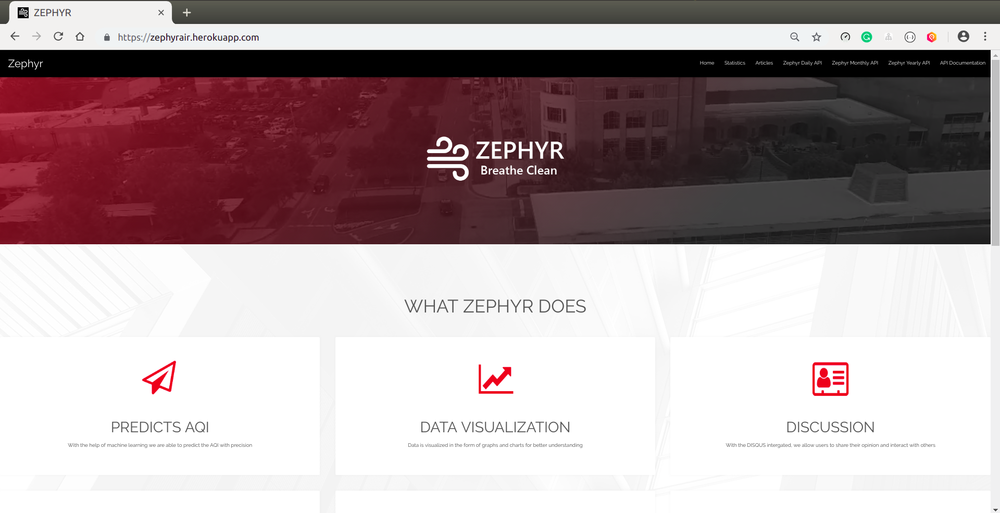

# ZEPHYR

Zephyr is a platform which provides users with the predicted AQI levels of air pollution for 39 cities of India with daily, monthly and yearly trends. It also provides some of the statistics observed for AQI over these cities and various latest articles and blogs related to air pollution.

You can see the live version of this application [here](https://zephyrair.herokuapp.com/).



## Instructions

1. Get the source code on your pc via git and navigate inside the folder through your terminal.

```
  git clone https://github.com/altruistcoder/Zephyr
```
2. Create a virtual environment and navigate inside it.

```
  virtualenv venv
```
3. Move the contents of cloned repository inside virtual environment folder.

4. Activate the virtual environment (You have to activate it everytime you are working on project).

```
  For mac users:

    source bin/activate  

  For windows users:

    .\Scripts\activate

  For Linux users:

    source activate <environment-name>
```

5. Now, install python dependencies.

```
  pip install -r requirements.txt
```
6. Now, navigate to the directory containing manage.py file.

7. Run following command:

```
  python manage.py migrate
  python manage.py runserver
```
8. Zephyr is ready for use. You can run it at [http://127.0.0.1:8000/](http://127.0.0.1:8000/).
